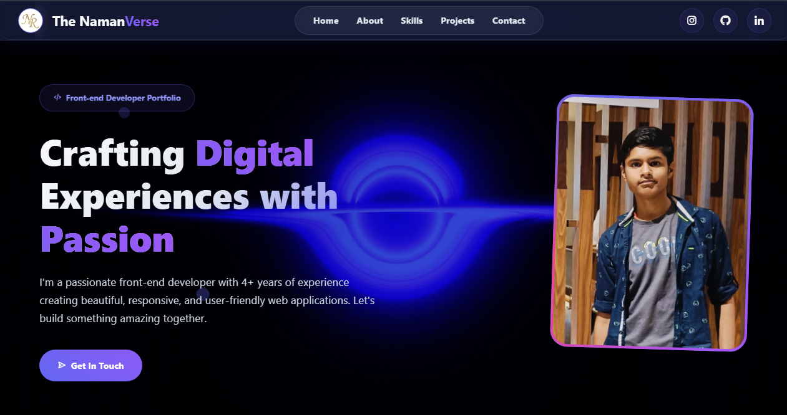

# 🌐 My Personal Portfolio Website- The NamanVerse

Welcome to my **Personal portfolio website** – a dynamic, responsive, and visually stunning project built entirely with **HTML, CSS, and JavaScript**. It showcases my skills, projects, and passion for clean, creative web design.

---

## 🚀 Features

- ⚡ Fast and lightweight
- 📱 Fully responsive across all devices
- 🎨 Clean, modern UI with smooth animations
- 💻 Built with 100% vanilla HTML, CSS, and JavaScript
- 🌈 Dark mode-ready (optional to add)
- 📬 Contact form with validation

---

## 🖼 Live Demo

🔗 [Visit Portfolio Website](https://naman7.netlify.app/) <!-- Replace with your actual URL -->

---

## 📸 Preview

 <!-- Replace with a screenshot or GIF -->

---

## 📁 Tech Stack

| Tech        | Description                 |
|-------------|-----------------------------|
| `HTML5`     | Markup structure            |
| `CSS3`      | Styling and layout          |
| `JavaScript`| Interactivity and dynamics  |

---
